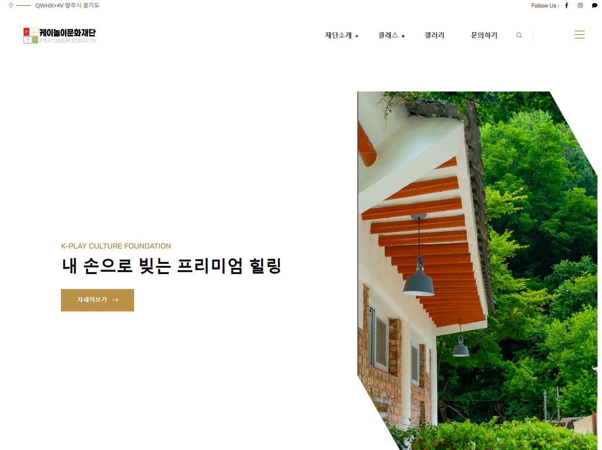
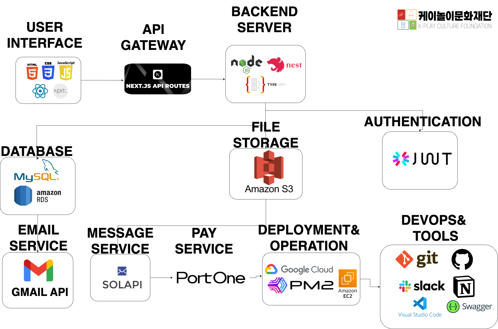
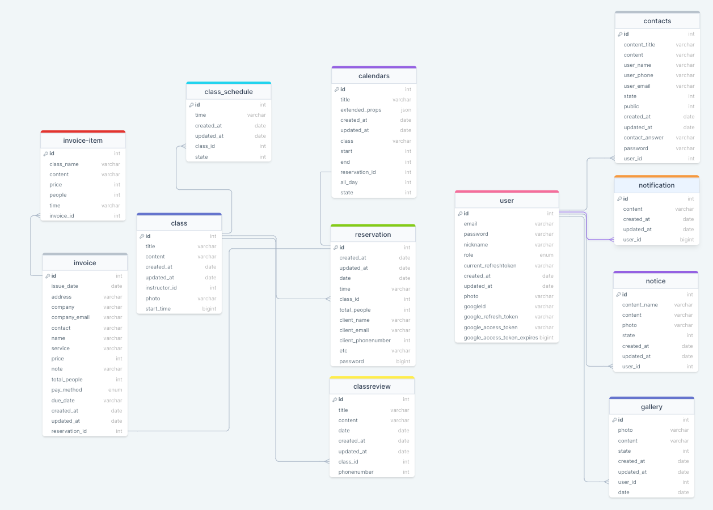

# 📌목차

1. [📄프로젝트 설명](#-프로젝트-설명)
2. [📚기술스택](#-기술-스택)
3. [🔧아키텍쳐](#-아키텍쳐)
4. [🏗️ERD](#-ERD)
5. [⚠️트러블 슈팅](#-트러블-슈팅)
6. [🍏환경 변수](#-환경-변수)

 

# 📄 프로젝트 설명

### 도자기 원데이클래스 예약 웹사이트(Pottery One-Day Class Reservation Website)

 

경기도 양주시에 위치한 공방에서 제공하는 도자기 원데이클래스를 위한 예약 웹사이트입니다. 이 웹사이트를 통해 사용자는 쉽고 편리하게 원하는 날짜와 시간에 도자기 클래스를 예약할 수 있습니다. 이 웹사이트는 도자기 만들기에 관심이 있는 사람들에게 쉽고 편리하게 원데이 클래스를 예약할 수 있는 플랫폼을 제공하여, 창의적인 활동을 통한 즐거움과 만족감을 선사하는 것을 목표로 합니다. 또한, 공방의 효율적인 운영과 고객 만족도 향상에 기여하는 것을 목표로 합니다.

 
 

## 🚀 서비스 링크

    🏺🏺 <a href="https://www.knori.or.kr">도자기 원데이클래스 예약 웹사이트(Pottery One-Day Class Reservation Website)</a> 🏺🏺

 
 

## 📕 주요기능

- 예약 시스템: 사용자는 원하는 날짜와 시간대를 선택하여 도자기 클래스를 예약 및 조회할 수 있습니다.
- 클래스 정보: 각 클래스별로 제공되는 수업 내용을 상세히 확인할 수 있습니다.
- 갤러리: 공방 사진 및 체험 사진을 갤러리에서 조회할 수 있습니다.
- 문의: 예약 관련 문의를 등록해 관련 클래스에 대한 정보를 문의할 수 있습니다.

   
 <b>1. 개인/ 단체 예약 및 조회</b>  (👈 Click)

 

- 20명을 기준으로 개인과 단체 예약을 나눠 받습니다.(24년 6월 기준 단체예약만 가능하도록 설정)
- 예약이 들어오면 관리자는 예약 조회 후 승인/미승인 가능
- 예약을 승인하면 카카오 알림톡으로 고객에게 예약완료 알림톡이 전송되며 승인상태로 바뀜

   
 <b>2. 클래스 정보 및 리뷰 확인</b>  (👈 Click)

 

- 클래스 정보 조회를 통해 클라이언트에게 해당 클래스의 설명 및 안내
- 24년 6월 기준 클래스 리뷰기능은 업데이트 예정

   
 <b>3. 갤러리 사진 조회
</b>  (👈 Click)

 

- 갤러리 사진은 인스타그램 api 활용해 피드 사진을 불러옴

   
 <b>4. 문의하기 등록 및 조회
</b>  (👈 Click)

 

- 유저는 성함, 핸드폰 번호, 문의 내용 등으로 문의 등록이 가능
- 문의 답변 완료시 유저에게 문의답변 완료 카카오톡 알림톡 발송

 
 

# 📚 기술 스택

### ⚡ Frontend

    
    
    
    
    
    
    

### ⚡ Backend

   
    
    
    
   
   
  

### ⚡ Database

    
    
    

### ⚡ DevOps

    
  
    
   

 
  
  

### ⚡ Tools

    
    
      
         

 
 

# 🔧 아키텍쳐

 
 
 

# 🏗️ ERD

이해를 돕기위해 간소화한 ERD 입니다.

 
 

# ⚠️ 트러블 슈팅

  
 트러블슈팅1: <b>MySQL 배열로 데이터 받기</b> (👈 Click)

 

### 문제점

1. **사진 다중파일 업로드**
2. **MySQL과 같은 관계형 데이터베이스(RDBMS)는 일반적으로 배열을 데이터로 못 받음**

### **해결방안 및 의사결정**

1. **선택1. Photo 엔티티 추가**
2. **선택2. 배열 자료형을 문자열로 변환해 저장**

   - 갤러리의 이미지는 갤러리와만 연결되어 있기 때문에 굳이 테이블을 추가해서 DB의 성능을 떨어뜨리는 것보다 역 정규화를 통해 단순히 배열 그대로 테이블에 집어넣는 방식인 2번을 선택.

- JSON.stringify를 통해 문자열로 변환시켜 DB에 저장
   

  
 트러블슈팅2: <b>Gmail API</b> (👈 Click)

 

### **문제점**

도서 데이터를 DB에서 불러오는 과정에서 대량의 데이터를 처리하는 데 시간이 소요되어 사용자 경험이 저하됐다.

### **해결방안 및 의사결정**

**도서 데이터 조회 성능 개선:**

1. **SQL 쿼리문 활용**

- 데이터베이스 쿼리문에서 불필요한 데이터를 최소화하고, 필요한 데이터만을 선택적으로 가져올 수 있도록 SQL 쿼리문을 최적화한다.
- 특정 검색어에 해당하는 도서의 id, 타이틀과 이미지 URL만을 선택하여 가져오도록 수정해서 가져오는 데이터 양을 최소화한다.

2. **Redis 캐싱 기능 활용:**

- 검색어를 키로 사용하여 도서 데이터의 일부를 Redis에 캐시로 저장한다.
- 사용자가 도서를 검색할 때, 먼저 Redis 캐시에서 데이터를 찾고, 없을 경우 DB에서 최적화된 데이터를 가져와서 Redis에 저장한다.
- 캐시 만료 기간을 설정하여 주기적으로 데이터를 갱신하도록 한다.

### **구현 계획**

1. **도서 데이터 조회 성능 개선:**

- SQL 쿼리문을 수정하여 필요한 데이터만을 효율적으로 가져오도록 최적화한다.
- 가져오는 데이터 양을 최소화하여 성능 향상을 기대할 수 있도록 한다.

1. **Redis 캐싱 구현:**

- 검색 시 Redis에 캐시된 데이터가 있는지 확인하고, 없으면 DB에서 데이터를 가져와서 Redis에 저장하는 로직을 개발한다.
- Redis에 저장되는 키는 검색어로, 값은 해당 도서 데이터로 한다.
- 캐시 만료 기간은 2분으로 설정함.

### **예상 효과**

**데이터 로드 속도 향상:**

- 효율적인 SQL 쿼리문과 최소한의 필수 데이터만을 가져오는 방식으로 데이터 로드 속도를 향상시켜 사용자 경험을 개선합니다.
- Redis 캐싱을 통해 반복적인 요청에 대한 성능 향상을 기대할 수 있습니다.
   

 

  
 트러블슈팅3: <b>영수증 조작 이슈</b> (👈 Click)

 

OCR 선정 이유

## 

OCR 중에서 비교해 보니 종합적으로 google cloud vision이 제일 적합하다고 느꼈다.

### 문제점

**1. 영수증 조작 문제**

OCR은 사진을 텍스트로 변환 하는 것이므로 영수증에 들어갈만한 keyword인지 판별 후 가져오는 것으로 코드를 작성하였다.

만약 해당 키워드가 포함되면 모두 영수증으로 인식 후, 가게명, 주소가 같다면 종이 위조 영수증도 영수증으로 인식된다.

또한, 환불 영수증에 대한 따로 유효성 처리가 없다.

### **해결방안 및 의사결정**

1. **영수증 패턴인식 모델 학습**

- 영수증 데이터 정보를 인식시켜서 학습시키는 방법을 생각했지만, 실제적으로 실현되기 어렵다.

1. **영수증 전용 템플릿 이용하기**

- Azure Document Intelligence 와 같이 영수증 전용 템플릿을 사용하려고 하였으나 영수증 전용 템플릿은 올리는 사진이 영수증이라는 가정하에 적힌 정보를 추출해내므로 keyword 처리만 없을 뿐 위조가 가능하다는 문제가 발생한다.

1.  **영수증을 직접 관리자가 확인 하기**

- 사용자가 영수증을 올리면 관리자에게 영수증 사진이 보내지게 되며 관리자가 확인 후 영수증을 승인하는 방식이다.

위의 해결방안 중 위조방지를 위해 영수증을 직접 관리자가 확인하는 과정이 필수이므로 영수증 전용 템플릿을 이용하기 보다는 키워드로 영수증 여부를 확인하는 코드에서 **영수증을 직접 관리자가 확인 하는 코드를 추가하는 것을 선택하였습니다.**

### 구현 계획

1. **Google storage에 영수증 사진을 저장:**

- 사진을 올리면 Google storage에 사진파일을 저장

1. **저장된 영수증 사진을 Slack으로 전송:**

- 영수증 키워드 판별, 일치하는 가게 정보 및 주소, 중복영수증 판별 조건 통과 시 slack으로 사진과 DB에 저장된 id 값 전송

1. **영수증 판별:**

- Slack 알림을 통해 관리자가 영수증 상태(승인, 미승인)을 변경하는 로직 추가

### 예상 효과

1. **위조된 영수증 판별:**

영수증을 관리자가 확인함으로 인해 위조된 영수증 판별이 가능

 

 

  
 트러블슈팅4: <b>wkx/parser</b> (👈 Click)

 

### 문제점

TypeORM을 이용하면 MySQL에 위치값을 나타내는 형식인 Point(x, y) 값을 집어넣을 수 없는 문제

### 해결방안

TypeORM에서 지원하는 Queryselector를 이용해 실제 SQL 쿼리와 비슷한 형태로 값을 집어넣는 방안(wkx)

저장된 값을 그대로 사용할 수 없어 Point를 **Parser 라이브러리**를 이용해 거리 계산 및 주변 지점 찾기 기능 완성

 
 

## 🍏 환경 변수

  
 <b>환경 변수 설정</b> (👈 Click)

 

다음은 프로젝트를 실행하기 위해 필요한 환경 변수들입니다. 프로젝트를 실행하기 전에 이 변수들을 설정해야 합니다.

## Database 설정

- **DATABASE_HOST**: 데이터베이스 호스트
- **DATABASE_PORT**: 데이터베이스 포트
- **DATABASE_USERNAME**: 데이터베이스 사용자 이름
- **DATABASE_PASSWORD**: 데이터베이스 암호
- **DATABASE_NAME**: 데이터베이스 이름
- **DATABASE_SYNC**: 데이터베이스 동기화 여부

## 서버 설정

- **SERVER_PORT**: 서버 포트

## JWT 토큰 설정

- **JWT_ACCESS_TOKEN_SECRET**: 액세스 토큰 비밀키
- **JWT_ACCESS_TOKEN_EXP**: 액세스 토큰 만료 시간
- **JWT_REFRESH_TOKEN_SECRET**: 리프레시 토큰 비밀키
- **JWT_REFRESH_TOKEN_EXP**: 리프레시 토큰 만료 시간

## AWS 설정

- **AWS_REGION**: AWS 리전
- **AWS_S3_ACCESS_KEY**: AWS S3 액세스 키
- **AWS_S3_SECRET_ACCESS_KEY**: AWS S3 비밀 액세스 키
- **AWS_S3_BUCKET_NAME**: AWS S3 버킷 이름

## PortOne 설정

- **PORTONE_REST_API_KEY**: PortOne API 키
- **PORTONE_REST_API_SECRET**: PortOne API 시크릿

## Solapi 설정

- **SOLAPI_API_KEY**: Solapi API 키
- **SOLAPI_API_SECRET_KEY**: Solapi API 시크릿 키
- **FROM_PHONE_NUMBER**: 발신 전화번호
- **PF_ID**: PF ID

## Google OAuth 설정

- **GOOGLE_CLIENT_ID**: Google 클라이언트 ID
- **GOOGLE_CLIENT_SECRET**: Google 클라이언트 시크릿
- **GOOGLE_CALLBACK_URL**: Google 콜백 URL

 
 

 
 
